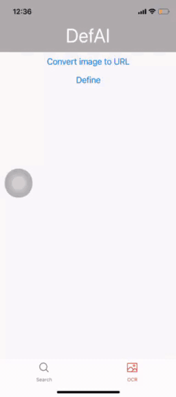

# DefAI - Definition Bot

## Maintainer

Tuan Nguyen

## Topic

DefAI takes an english word that exists in the dictionary, and produces the definitions and attributes of all the types that word can have as well as pronunciation. In addition, there will also be a place for images and emojis of demonstration, if available.

## How It Works

DefAI works as simply as other dictionary applications. Users can enter an english word, or upload an image that has an english word, and DefAI will show all the possible definitions and attributes that word can have as well as an image of the word.  
You can watch this video for in-depth code details of DefAI: [DefAI demonstration video](https://youtu.be/ZGa2IrB6Ek4)  
Here is the sketch of the app: 

## Release timestamps

### Release 1: 2021-04-26 features

- Users can now search for definitions of English words with correct meanings.
- Users can view the text as well as image.
- Users can clear the current definitions view.
- Users can interact with the search bar clear text icon.

### Release 2: 2021-05-14 features

Beside the features from Release 1:

- Users can now use the OCR feature to get definitions of English words extracted from images from photo library.

## Known bugs

After the Release 1 and 2, there are some bugs that users want to avoid:

- Landscape view is not implemented.
- Searching words with special characters somehow still triggers the Define component.
- OCR feature can sometimes render quite slowly, and the rendering might make mistakes and give results different to ground truth.
- Possible unhandled promise rejection from FileSystem.readAsStringAsync, yet it does not affect the app too much.

## Recommendations for best user experience

- Try to avoid both entering words containing special characters and/or numbers, and upload images whose first word may contain special characters and/or numbers.
- For OCR feature, it's best to use images that has only one English word, with no special characters and numbers, so that it does not cause unwanted bugs or errors.

## API and Packages

DefAI will mainly be using OwlBot Dictionary API and Unsplash Photos API. 

### OwlBot

OwlBot is a dictionary API that can provide definitions and attributes for plenty of English words. 
There are some drawbacks to the API:

- Some common English words are not available.
- Some attributes may be missing from the searching words.

Check out the [OwlBot Dictionary API](https://owlbot.info/) website for more information. 
The npm package version of the API: [owlbot-js](https://www.npmjs.com/package/owlbot-js) 
Example endpoint to fetch API: [OwlBot API Endpoint](https://owlbot.info/api/v4/dictionary/owl)

### Unsplash

Unsplash is an API service that provides a wide range of photos in many sizes and different categories. 

Check out the [Unsplash Developers](https://unsplash.com/documentation) website for more information. 
Example endpoint to fetch API: [Unsplash API Endpoint](https://api.unsplash.com/photos)

### Google Cloud Vision API

Cloud Vision API is an API service from Google's Google Cloud Platform, where users can work with and utilize many features of the most advanced technologies in Computer Vision.

Check out the [Cloud Vision API](https://cloud.google.com/vision) for more information. 
Explore the [Cloud Vision documentation](https://cloud.google.com/vision/docs) for all the guides, references, use cases.

### Authorization

Since both APIs require specific OAuth tokens to fetch the necessary information, I'm using dotenv file to store the API tokens and not to push them to the repository. 
In order to make use of the dotenv file, I created environment variables and used a package that supports dotenv file. 
Information about Environment Variables in Expo: [Environment variables in Expo](https://docs.expo.io/guides/environment-variables/) 
Details of the package babel-plugin-inline-dotenv: [babel-plugin-inline-dotenv](https://github.com/brysgo/babel-plugin-inline-dotenv)

## Target

The application will be available to both iOS and Android.

## Language

DefAI will be developed using React Native and expo-cli.
